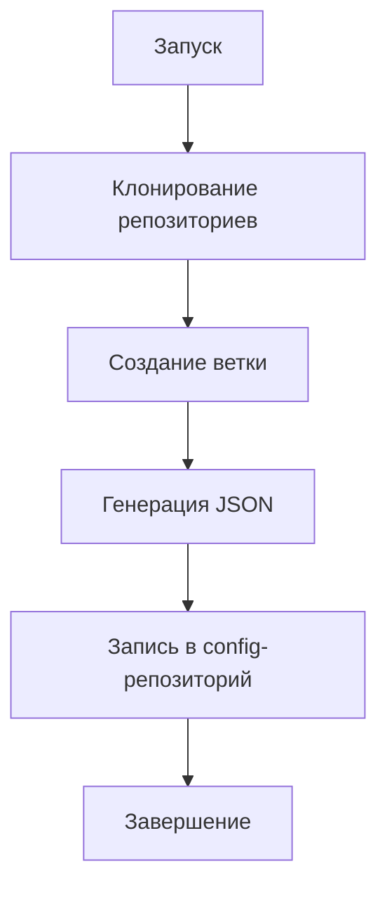

# 🚀 Release Automation Tool | Инструмент автоматизации релизов
<div align="center">    <br><br> </div>


## 🌍 Языки / Languages
🇷🇺 Русский | 🇬🇧 English

### 🔥 Возможности / Features

  |          | 🇷🇺 Русский | 🇬🇧 English |
  |----------| --- | --- |
   | ✔  | Создание версионированных git-веток |Versioned git branches creation|
   | ✔ | Генерация JSON-конфигов релиза |Release JSON configs generation|
   | ✔ | Гибкое именование файлов |Flexible file naming|
  | ✔ | Интеграция с CI/CD |CI/CD integration|

# 🛠 Установка / Installation

``` 
### Клонировать репозиторий / Clone repository

git clone https://github.com/your/release-automation.git
cd release-automation

### Собрать бинарник / Build binary

go build -o release-automation
 
### Проверить версию / Check version

 ./release-automation --version
 ```
# 🚀 Использование / Usage
 ```./release-automation \
<target-repo-ssh> \    # Целевой репозиторий
<config-repo-ssh> \    # Репозиторий для конфигов
<source-branch> \      # Исходная ветка
<version> \            # Версия релиза (1.0.0)
<project-name> \       # Название проекта
[file-suffix]          # Суффикс файла (опционально)
```


### 🌟 Пример / Example

```
./release-automation \
  git@github.com:company/app.git \
  git@github.com:company/configs.git \
  main \
  2.3.1 \
  awesome-project \
  production
```
## Генерируемый JSON / Output JSON
```dtd
{
  "release": "automation-delivery",
  "project": "awesome-project",
  "source": [],
  "deploy": [
    {
      "name": "awesome-project",
      "branch": "main-v2.3.1",
      "commit": "a1b2c3d4e5f67890"
    }
  ],
  "repositories": []
}
```

## 🔧 Интеграция с Jenkins / Jenkins Integration
```dtd
pipeline {
    agent any
    stages {
        stage('Create Release') {
            steps {
                withCredentials([
                    sshUserPrivateKey(credentialsId: 'repo-key', keyFileVariable: 'SSH_KEY')
                ]) {
                    sh '''
                        chmod 600 $SSH_KEY
                        export GIT_SSH_COMMAND="ssh -i $SSH_KEY"
                        ./release-automation \
                            $TARGET_REPO \
                            $CONFIG_REPO \
                            $BRANCH \
                            $VERSION \
                            $PROJECT \
                            $SUFFIX
                    '''
                }
            }
        }
    }
}
```

## 🎨 Диаграмма работы / Workflow



<div align="center"> <br>  </div> ```